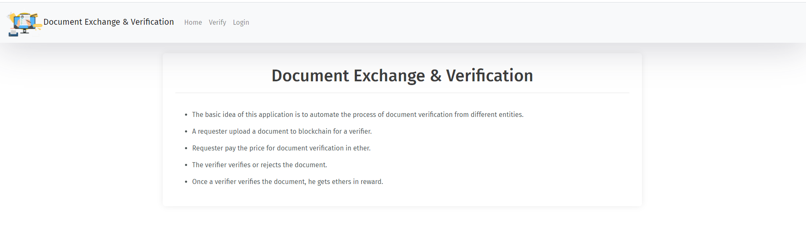
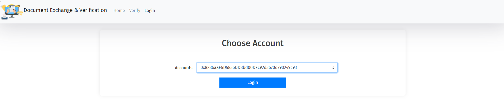
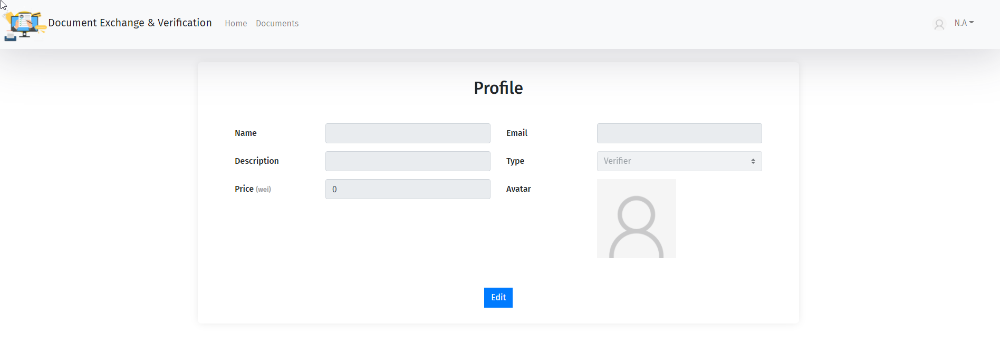
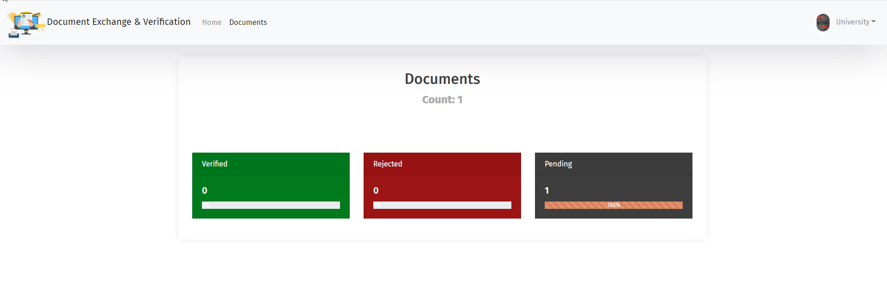
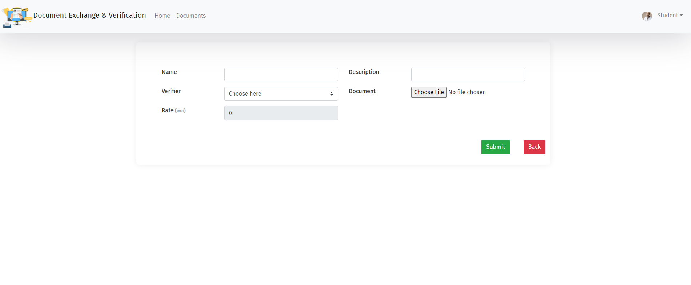
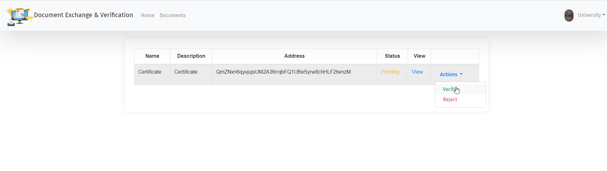
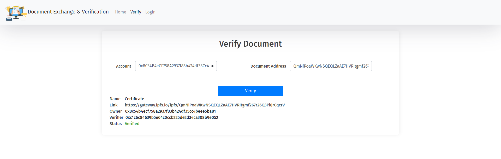
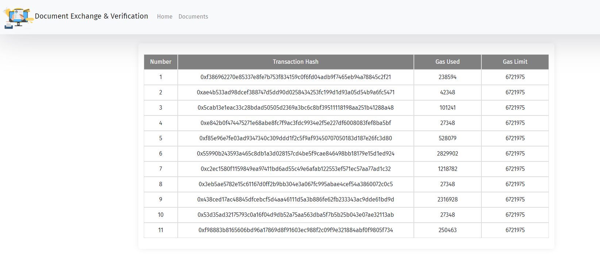

# Document Exchange & Verfication Using Truffle & IPFS

This Dapp is made On **Etherum Blockchian** & **IPFS** with Interface on **React.js*

## Features

1. Decantralized Document Storage Using IPFS
2. Profile Creation For Requester
3. Profile Creation And Cost Of Verfication For Verfier
4. Document Submission
5. Verify/Reject Document to be stored on Etherum Blockchian
6. Transaction Pannel
7. Document Status Checker

## Images

  
  
  
  
  
  
  
    